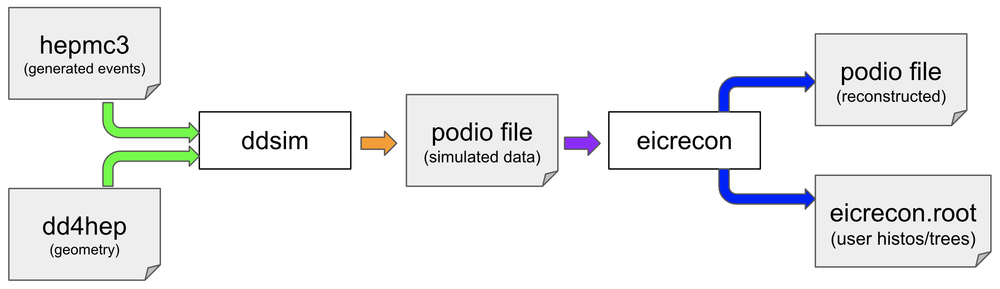

::::::::::::::::::::::::::::::::::::::::::::: questions

- Where does EICrecon fit into the ePIC software ecosystem?

:::::::::::::::::::::::::::::::::::::::::::::

::::::::::::::::::::::::::::::::::::::::::::: objectives

- Understand scope of tutorial and how EICrecon fits into larger software ecosystem.

:::::::::::::::::::::::::::::::::::::::::::::

In this episode we will introduce EICrecon and show where it fits into the ePIC software stack. We will
briefly cover the scope of this tutorial and functionality will be covered.

{alt="Diagram of the simulated data flow through the ePIC software stack"}

::::::::::::::::::::::::::::::::::::::::::::: keypoints

- EICrecon is the reconstruction piece of ePIC software.

:::::::::::::::::::::::::::::::::::::::::::::
